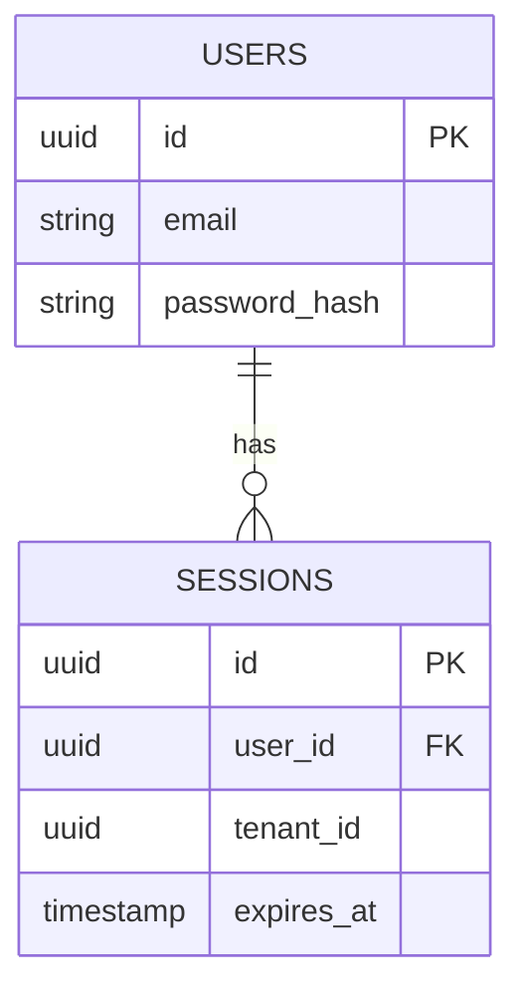
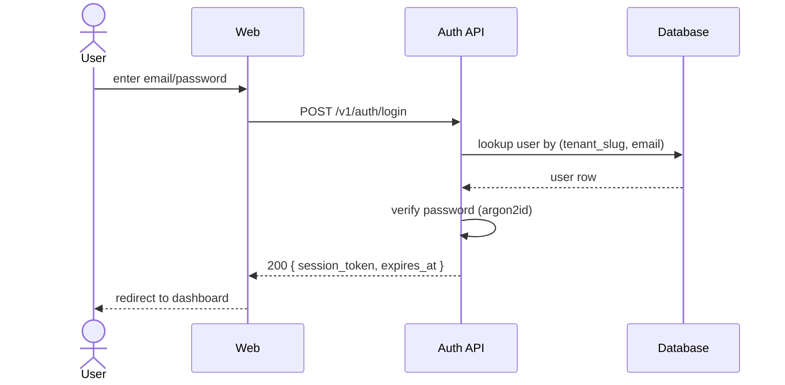
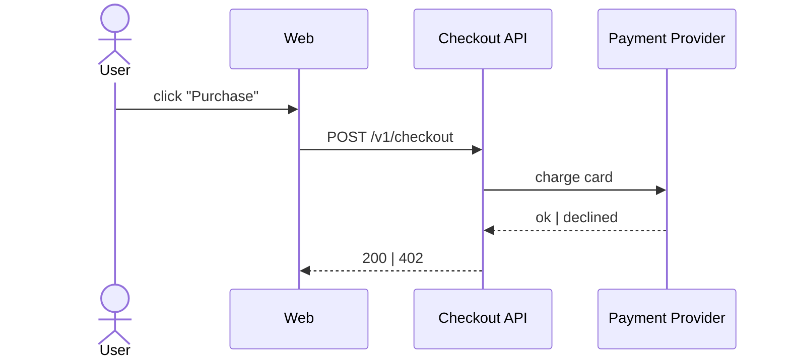

# GitHub PR Doc Reviewer Implementation Plan

> **For agentic workers:** REQUIRED SUB-SKILL: Use superpowers:subagent-driven-development (recommended) or superpowers:executing-plans to implement this plan task-by-task. Steps use checkbox (`- [ ]`) syntax for tracking.

**Goal:** Build a `github-pr-doc-reviewer/` sample under `conoha-cli-app-samples/` that deploys a self-hosted GitHub Actions runner with a Composite Action which AI-reviews PR documentation changes and posts comments.

**Architecture:** ConoHa VPS runs a Docker container based on `myoung34/github-runner` with `claude` CLI pre-installed and OAuth credentials persisted on a named volume. A Composite Action (`action/action.yml`) packaged in the same repo dispatches between `quick` (mechanical checks → sticky comment) and `deep` (mechanical + Claude semantic analysis → inline PR review) modes. A demo fixture under `examples/specs-fixture/` provides a runnable showcase.

**Tech Stack:** Bash, `myoung34/github-runner` Docker image, `claude` CLI (Claude Code), `gh` CLI, `jq`, `bats` (tests), GitHub Composite Actions.

**Reference Spec:** `docs/superpowers/specs/2026-04-29-github-pr-doc-reviewer-design.md`

---

## File Structure

```
github-pr-doc-reviewer/
├── README.md
├── compose.yml
├── Dockerfile
├── entrypoint.sh
├── action/
│   ├── action.yml
│   └── scripts/
│       ├── review.sh
│       ├── review-quick.sh
│       ├── review-deep.sh
│       ├── prompts/{system.md, deep-review.md}
│       ├── lib/{github.sh, markdown.sh, http-link.sh}
│       └── fixtures/claude-mock.json
├── workflow-template/doc-review.yml
├── examples/specs-fixture/...
├── docs/{setup.md, user-guide.md}
└── tests/
    ├── markdown.bats
    └── e2e/{fixture-pr-quick.sh, fixture-pr-deep.sh}
```

Plus root-level: update `README.md` to register the sample.

**Working directory for all paths below:** `conoha-cli-app-samples/` (the repo root).

**Convention:** Commit prefix `feat(github-pr-doc-reviewer): ...` / `test(github-pr-doc-reviewer): ...` / `docs(github-pr-doc-reviewer): ...` matching this repo's existing style.

---

## Task 1: Scaffold sample directory + bats fixture skeleton

**Files:**
- Create: `github-pr-doc-reviewer/action/scripts/lib/markdown.sh` (empty stub)
- Create: `github-pr-doc-reviewer/tests/markdown.bats`
- Create: `github-pr-doc-reviewer/tests/fixtures/sample-good.md`
- Create: `github-pr-doc-reviewer/tests/fixtures/sample-with-issues.md`

- [ ] **Step 1: Create directory tree**

```bash
mkdir -p github-pr-doc-reviewer/action/scripts/{lib,prompts,fixtures}
mkdir -p github-pr-doc-reviewer/workflow-template
mkdir -p github-pr-doc-reviewer/examples/specs-fixture/{domains,adr}
mkdir -p github-pr-doc-reviewer/examples/specs-fixture/domains/{auth,checkout}
mkdir -p github-pr-doc-reviewer/examples/specs-fixture/domains/auth/{flows,screens}
mkdir -p github-pr-doc-reviewer/examples/specs-fixture/domains/checkout/{flows,screens}
mkdir -p github-pr-doc-reviewer/docs
mkdir -p github-pr-doc-reviewer/tests/{e2e,fixtures}
```

- [ ] **Step 2: Create empty markdown.sh stub**

`github-pr-doc-reviewer/action/scripts/lib/markdown.sh`:

```bash
#!/usr/bin/env bash
# Mechanical markdown checks. Each function emits JSON Lines on stdout.

set -euo pipefail
```

- [ ] **Step 3: Create test fixtures**

`github-pr-doc-reviewer/tests/fixtures/sample-good.md`:

```markdown
# Sample Good Doc

This file has no issues.

## Section A

Some content.

## Section B

More content with a [valid link](./sample-with-issues.md).
```

`github-pr-doc-reviewer/tests/fixtures/sample-with-issues.md`:

```markdown
# Sample With Issues

This is a paragraph that mentions TBD: complete this later.

## Empty Section

## Has Content

Real content here.

## Broken Link Section

See [missing doc](./does-not-exist.md) for details.

Another line with TODO marker.
```

- [ ] **Step 4: Create bats skeleton**

`github-pr-doc-reviewer/tests/markdown.bats`:

```bash
#!/usr/bin/env bats

setup() {
  SCRIPT_DIR="$(cd "$(dirname "$BATS_TEST_FILENAME")/.." && pwd)"
  source "$SCRIPT_DIR/action/scripts/lib/markdown.sh"
  FIXTURES="$SCRIPT_DIR/tests/fixtures"
}

@test "smoke: bats harness loads markdown.sh" {
  run bash -c "type check_todo_markers >/dev/null 2>&1; echo \$?"
  # Will fail until check_todo_markers is defined - this is intentional;
  # later tasks will satisfy it. For now, just confirm bats runs.
  [ -n "$output" ]
}
```

- [ ] **Step 5: Verify bats is installed and skeleton runs**

```bash
which bats || sudo apt-get install -y bats
cd github-pr-doc-reviewer
bats tests/markdown.bats
```

Expected: 1 test runs (passes — output is non-empty whether function exists or not).

- [ ] **Step 6: Commit**

```bash
git add github-pr-doc-reviewer/
git commit -m "feat(github-pr-doc-reviewer): scaffold directory + bats harness"
```

---

## Task 2: TDD — `check_todo_markers` function

**Files:**
- Modify: `github-pr-doc-reviewer/action/scripts/lib/markdown.sh`
- Modify: `github-pr-doc-reviewer/tests/markdown.bats`

- [ ] **Step 1: Write failing tests**

Append to `github-pr-doc-reviewer/tests/markdown.bats`:

```bash
@test "check_todo_markers detects TBD" {
  run check_todo_markers "$FIXTURES/sample-with-issues.md"
  [ "$status" -eq 0 ]
  echo "$output" | grep -q '"category":"todo-marker"'
  echo "$output" | grep -q '"line":3'
}

@test "check_todo_markers detects TODO" {
  run check_todo_markers "$FIXTURES/sample-with-issues.md"
  [ "$status" -eq 0 ]
  count=$(echo "$output" | grep -c '"category":"todo-marker"' || true)
  [ "$count" -ge 2 ]
}

@test "check_todo_markers reports nothing on clean file" {
  run check_todo_markers "$FIXTURES/sample-good.md"
  [ "$status" -eq 0 ]
  [ -z "$output" ]
}
```

- [ ] **Step 2: Run tests — verify they fail**

```bash
cd github-pr-doc-reviewer
bats tests/markdown.bats
```

Expected: 3 new tests fail with "command not found: check_todo_markers".

- [ ] **Step 3: Implement `check_todo_markers`**

Append to `github-pr-doc-reviewer/action/scripts/lib/markdown.sh`:

```bash
# check_todo_markers FILE
# Emits JSON Lines for each TBD/TODO/FIXME/??? marker.
check_todo_markers() {
  local file="$1"
  [ -f "$file" ] || return 0
  grep -nE '\b(TBD|TODO|FIXME)\b|\?\?\?' "$file" 2>/dev/null | while IFS=: read -r line content; do
    local trimmed
    trimmed=$(printf '%s' "$content" | sed -E 's/^[[:space:]]+//' | cut -c1-80)
    jq -nc \
      --arg path "$file" \
      --argjson line "$line" \
      --arg msg "Marker found: $trimmed" \
      '{path: $path, line: $line, severity: "warning", category: "todo-marker", message: $msg}'
  done
}
```

- [ ] **Step 4: Run tests — verify they pass**

```bash
bats tests/markdown.bats
```

Expected: All tests pass.

- [ ] **Step 5: Commit**

```bash
git add github-pr-doc-reviewer/action/scripts/lib/markdown.sh github-pr-doc-reviewer/tests/markdown.bats
git commit -m "feat(github-pr-doc-reviewer): add check_todo_markers with bats coverage"
```

---

## Task 3: TDD — `check_empty_sections` function

**Files:**
- Modify: `github-pr-doc-reviewer/action/scripts/lib/markdown.sh`
- Modify: `github-pr-doc-reviewer/tests/markdown.bats`

- [ ] **Step 1: Write failing tests**

Append to `github-pr-doc-reviewer/tests/markdown.bats`:

```bash
@test "check_empty_sections detects header followed by another header" {
  run check_empty_sections "$FIXTURES/sample-with-issues.md"
  [ "$status" -eq 0 ]
  echo "$output" | grep -q '"category":"empty-section"'
  echo "$output" | grep -q '"Empty Section"'
}

@test "check_empty_sections does not flag sections with content" {
  run check_empty_sections "$FIXTURES/sample-good.md"
  [ "$status" -eq 0 ]
  [ -z "$output" ]
}
```

- [ ] **Step 2: Run tests — verify they fail**

```bash
bats tests/markdown.bats
```

Expected: 2 new tests fail.

- [ ] **Step 3: Implement `check_empty_sections`**

Append to `github-pr-doc-reviewer/action/scripts/lib/markdown.sh`:

```bash
# check_empty_sections FILE
# Emits JSON Lines for headers that have no content before the next header or EOF.
check_empty_sections() {
  local file="$1"
  [ -f "$file" ] || return 0
  awk '
    function emit() {
      if (in_section && !has_content) {
        print header_line "\t" header_text
      }
    }
    /^#+[[:space:]]+/ {
      emit()
      header_line = NR
      header_text = $0
      sub(/^#+[[:space:]]+/, "", header_text)
      in_section = 1
      has_content = 0
      next
    }
    in_section && NF > 0 { has_content = 1 }
    END { emit() }
  ' "$file" | while IFS=$'\t' read -r line text; do
    jq -nc \
      --arg path "$file" \
      --argjson line "$line" \
      --arg msg "Empty section: $text" \
      '{path: $path, line: $line, severity: "warning", category: "empty-section", message: $msg}'
  done
}
```

- [ ] **Step 4: Run tests — verify they pass**

```bash
bats tests/markdown.bats
```

Expected: All tests pass.

- [ ] **Step 5: Commit**

```bash
git add github-pr-doc-reviewer/action/scripts/lib/markdown.sh github-pr-doc-reviewer/tests/markdown.bats
git commit -m "feat(github-pr-doc-reviewer): add check_empty_sections"
```

---

## Task 4: TDD — `check_internal_links` function

**Files:**
- Modify: `github-pr-doc-reviewer/action/scripts/lib/markdown.sh`
- Modify: `github-pr-doc-reviewer/tests/markdown.bats`

- [ ] **Step 1: Write failing tests**

Append to `github-pr-doc-reviewer/tests/markdown.bats`:

```bash
@test "check_internal_links detects missing target file" {
  run check_internal_links "$FIXTURES/sample-with-issues.md"
  [ "$status" -eq 0 ]
  echo "$output" | grep -q '"category":"broken-internal-link"'
  echo "$output" | grep -q 'does-not-exist.md'
}

@test "check_internal_links does not flag valid relative links" {
  run check_internal_links "$FIXTURES/sample-good.md"
  [ "$status" -eq 0 ]
  [ -z "$output" ]
}

@test "check_internal_links ignores http(s) and mailto and anchors" {
  cat > "$BATS_TMPDIR/external.md" <<'EOF'
# Header

[github](https://github.com/)
[email](mailto:a@b.c)
[anchor](#section)
EOF
  run check_internal_links "$BATS_TMPDIR/external.md"
  [ "$status" -eq 0 ]
  [ -z "$output" ]
}
```

- [ ] **Step 2: Run tests — verify they fail**

```bash
bats tests/markdown.bats
```

Expected: 3 new tests fail.

- [ ] **Step 3: Implement `check_internal_links`**

Append to `github-pr-doc-reviewer/action/scripts/lib/markdown.sh`:

```bash
# check_internal_links FILE
# Emits JSON Lines for [label](path) where path is relative and target missing.
check_internal_links() {
  local file="$1"
  [ -f "$file" ] || return 0
  local dir
  dir="$(dirname "$file")"
  grep -noE '\[[^]]+\]\([^)]+\)' "$file" 2>/dev/null | while IFS=: read -r line match; do
    local url
    url=$(printf '%s' "$match" | sed -E 's/.*\(([^)]+)\)$/\1/')
    case "$url" in
      http://*|https://*|mailto:*|\#*|"") continue ;;
    esac
    local path="${url%%#*}"
    path="${path%%\?*}"
    [ -z "$path" ] && continue
    local target
    if [[ "$path" = /* ]]; then
      target="${path#/}"
    else
      target="$dir/$path"
    fi
    if [ ! -e "$target" ]; then
      jq -nc \
        --arg path "$file" \
        --argjson line "$line" \
        --arg msg "Broken link: $url" \
        '{path: $path, line: $line, severity: "error", category: "broken-internal-link", message: $msg}'
    fi
  done
}
```

- [ ] **Step 4: Run tests — verify they pass**

```bash
bats tests/markdown.bats
```

Expected: All tests pass.

- [ ] **Step 5: Commit**

```bash
git add github-pr-doc-reviewer/action/scripts/lib/markdown.sh github-pr-doc-reviewer/tests/markdown.bats
git commit -m "feat(github-pr-doc-reviewer): add check_internal_links"
```

---

## Task 5: HTTP external link checker (`http-link.sh`)

**Files:**
- Create: `github-pr-doc-reviewer/action/scripts/lib/http-link.sh`
- Modify: `github-pr-doc-reviewer/tests/markdown.bats`

- [ ] **Step 1: Write failing tests**

Append to `github-pr-doc-reviewer/tests/markdown.bats`:

```bash
@test "check_external_link returns severity=info on connection failure" {
  source "$SCRIPT_DIR/action/scripts/lib/http-link.sh"
  run check_external_link "http://localhost:1/nonexistent" "fixture.md" 5
  [ "$status" -eq 0 ]
  echo "$output" | grep -q '"severity":"info"'
  echo "$output" | grep -q '"category":"broken-external-link"'
}

@test "check_external_link is silent on success" {
  source "$SCRIPT_DIR/action/scripts/lib/http-link.sh"
  # Use a stable, fast endpoint. Skip if curl absent.
  command -v curl >/dev/null || skip "curl not available"
  run check_external_link "https://example.com/" "fixture.md" 5
  [ "$status" -eq 0 ]
  [ -z "$output" ]
}
```

- [ ] **Step 2: Run tests — verify they fail**

```bash
bats tests/markdown.bats
```

Expected: 2 new tests fail.

- [ ] **Step 3: Implement `http-link.sh`**

`github-pr-doc-reviewer/action/scripts/lib/http-link.sh`:

```bash
#!/usr/bin/env bash
# External HTTP link checks. Single retry, conservative reporting.

set -euo pipefail

# check_external_link URL FILE LINE
# Emits JSON Line on failure (after retry). Silent on success.
check_external_link() {
  local url="$1"
  local file="$2"
  local line="${3:-0}"
  local code
  code=$(curl -sS -o /dev/null -w '%{http_code}' --max-time 10 -I "$url" 2>/dev/null || echo "000")
  if [ "$code" = "000" ] || [ "${code:0:1}" = "4" ] || [ "${code:0:1}" = "5" ]; then
    # retry once
    sleep 1
    code=$(curl -sS -o /dev/null -w '%{http_code}' --max-time 10 -I "$url" 2>/dev/null || echo "000")
    if [ "$code" = "000" ] || [ "${code:0:1}" = "4" ] || [ "${code:0:1}" = "5" ]; then
      jq -nc \
        --arg path "$file" \
        --argjson line "$line" \
        --arg msg "External link unreachable ($code): $url" \
        '{path: $path, line: $line, severity: "info", category: "broken-external-link", message: $msg}'
    fi
  fi
}
```

- [ ] **Step 4: Run tests — verify they pass**

```bash
bats tests/markdown.bats
```

Expected: All tests pass (or 1 skipped if curl absent).

- [ ] **Step 5: Commit**

```bash
git add github-pr-doc-reviewer/action/scripts/lib/http-link.sh github-pr-doc-reviewer/tests/markdown.bats
git commit -m "feat(github-pr-doc-reviewer): add http link checker with retry"
```

---

## Task 6: GitHub API helper — `update_sticky_comment`

**Files:**
- Create: `github-pr-doc-reviewer/action/scripts/lib/github.sh`

- [ ] **Step 1: Implement `update_sticky_comment`**

`github-pr-doc-reviewer/action/scripts/lib/github.sh`:

```bash
#!/usr/bin/env bash
# GitHub API helpers. Requires gh CLI authenticated via GITHUB_TOKEN.

set -euo pipefail

STICKY_MARKER='<!-- doc-reviewer:sticky -->'

# update_sticky_comment PR_NUMBER BODY_FILE
# Finds the bot's previous sticky comment (by hidden marker) and edits it,
# or creates a new comment if none exists.
update_sticky_comment() {
  local pr="$1"
  local body_file="$2"
  local repo="${GITHUB_REPOSITORY:?GITHUB_REPOSITORY not set}"

  # Search for existing sticky comment
  local existing_id
  existing_id=$(gh api "repos/$repo/issues/$pr/comments" --paginate \
    --jq ".[] | select(.body | contains(\"$STICKY_MARKER\")) | .id" \
    | head -n1)

  # Prepend marker so future runs can find this comment
  local body
  body=$(printf '%s\n\n%s' "$STICKY_MARKER" "$(cat "$body_file")")

  if [ -n "$existing_id" ]; then
    gh api "repos/$repo/issues/comments/$existing_id" \
      --method PATCH \
      -f body="$body" >/dev/null
    echo "Updated sticky comment $existing_id"
  else
    gh api "repos/$repo/issues/$pr/comments" \
      --method POST \
      -f body="$body" >/dev/null
    echo "Created sticky comment"
  fi
}
```

- [ ] **Step 2: Verify shell syntax**

```bash
bash -n github-pr-doc-reviewer/action/scripts/lib/github.sh
```

Expected: no output (clean syntax).

- [ ] **Step 3: Commit**

```bash
git add github-pr-doc-reviewer/action/scripts/lib/github.sh
git commit -m "feat(github-pr-doc-reviewer): add update_sticky_comment helper"
```

---

## Task 7: GitHub API helper — `post_review` (inline review)

**Files:**
- Modify: `github-pr-doc-reviewer/action/scripts/lib/github.sh`

- [ ] **Step 1: Append `post_review` and helpers**

Append to `github-pr-doc-reviewer/action/scripts/lib/github.sh`:

```bash
# post_review PR_NUMBER FINDINGS_JSONL SUMMARY_TEXT
# Posts a PR review with inline comments where line is known, and a
# summary body with general findings. Always uses event=COMMENT.
post_review() {
  local pr="$1"
  local findings_file="$2"
  local summary="$3"
  local repo="${GITHUB_REPOSITORY:?GITHUB_REPOSITORY not set}"

  # Build inline comments array from findings with line >= 1
  local comments_json
  comments_json=$(jq -s '
    [ .[] | select(.line != null and .line > 0) |
      { path: .path,
        line: .line,
        side: "RIGHT",
        body: ("**[" + (.severity|ascii_upcase) + " / " + .category + "]** " + .message)
      }
    ]
  ' "$findings_file")

  # General findings (no line) go into the body
  local general_md
  general_md=$(jq -r '
    select(.line == null or .line <= 0) |
    "- **[" + (.severity|ascii_upcase) + " / " + .category + "]** `" + .path + "`: " + .message
  ' "$findings_file" | sed '/^$/d')

  local body
  body=$(printf '## Doc Review (deep mode)\n\n%s\n' "$summary")
  if [ -n "$general_md" ]; then
    body=$(printf '%s\n\n### General findings\n\n%s\n' "$body" "$general_md")
  fi

  # Submit review
  local payload
  payload=$(jq -nc \
    --arg body "$body" \
    --argjson comments "$comments_json" \
    '{event: "COMMENT", body: $body, comments: $comments}')

  printf '%s' "$payload" | gh api "repos/$repo/pulls/$pr/reviews" \
    --method POST --input - >/dev/null
  echo "Posted review with $(echo "$comments_json" | jq 'length') inline comments"
}
```

- [ ] **Step 2: Verify shell syntax**

```bash
bash -n github-pr-doc-reviewer/action/scripts/lib/github.sh
```

Expected: clean.

- [ ] **Step 3: Commit**

```bash
git add github-pr-doc-reviewer/action/scripts/lib/github.sh
git commit -m "feat(github-pr-doc-reviewer): add post_review with inline + general comments"
```

---

## Task 8: `action.yml` — Composite Action interface

**Files:**
- Create: `github-pr-doc-reviewer/action/action.yml`

- [ ] **Step 1: Create `action.yml`**

`github-pr-doc-reviewer/action/action.yml`:

```yaml
name: 'Doc Review'
description: 'AI-powered documentation review for spec-as-code repositories'
author: 'crowdy'

inputs:
  mode:
    description: 'Review depth: quick (mechanical only) or deep (mechanical + Claude semantic analysis)'
    required: false
    default: 'quick'
  paths:
    description: 'Comma-separated globs for review target files'
    required: false
    default: '**/*.md,**/*.yml,**/*.yaml'
  glossary-path:
    description: 'Path to glossary file (used as context in deep mode for term consistency)'
    required: false
    default: 'glossary.md'
  adr-path:
    description: 'Directory containing Architecture Decision Records'
    required: false
    default: 'adr'
  fail-on-error:
    description: 'Exit non-zero if findings with severity=error exist'
    required: false
    default: 'false'
  github-token:
    description: 'Token for posting comments and reviews'
    required: false
    default: ${{ github.token }}

outputs:
  findings-count:
    description: 'Total number of findings'
    value: ${{ steps.review.outputs.findings_count }}
  errors-count:
    description: 'Findings with severity=error'
    value: ${{ steps.review.outputs.errors_count }}

runs:
  using: 'composite'
  steps:
    - id: review
      shell: bash
      env:
        MODE: ${{ inputs.mode }}
        PATHS: ${{ inputs.paths }}
        GLOSSARY_PATH: ${{ inputs.glossary-path }}
        ADR_PATH: ${{ inputs.adr-path }}
        FAIL_ON_ERROR: ${{ inputs.fail-on-error }}
        GITHUB_TOKEN: ${{ inputs.github-token }}
        ACTION_PATH: ${{ github.action_path }}
      run: |
        bash "$ACTION_PATH/scripts/review.sh"
```

- [ ] **Step 2: Validate YAML syntax**

```bash
python3 -c "import yaml; yaml.safe_load(open('github-pr-doc-reviewer/action/action.yml'))"
```

Expected: no output (valid YAML).

- [ ] **Step 3: Commit**

```bash
git add github-pr-doc-reviewer/action/action.yml
git commit -m "feat(github-pr-doc-reviewer): add Composite Action interface (action.yml)"
```

---

## Task 9: `review.sh` — main dispatcher

**Files:**
- Create: `github-pr-doc-reviewer/action/scripts/review.sh`

- [ ] **Step 1: Implement dispatcher**

`github-pr-doc-reviewer/action/scripts/review.sh`:

```bash
#!/usr/bin/env bash
# Main dispatcher: routes to review-quick.sh or review-deep.sh based on $MODE.

set -euo pipefail

: "${MODE:=quick}"
: "${PATHS:=**/*.md,**/*.yml,**/*.yaml}"
: "${GLOSSARY_PATH:=glossary.md}"
: "${ADR_PATH:=adr}"
: "${FAIL_ON_ERROR:=false}"
: "${ACTION_PATH:?ACTION_PATH not set}"
: "${GITHUB_TOKEN:?GITHUB_TOKEN not set}"

export GH_TOKEN="$GITHUB_TOKEN"

SCRIPT_DIR="$ACTION_PATH/scripts"
WORK_DIR="$(mktemp -d)"
trap 'rm -rf "$WORK_DIR"' EXIT

# shellcheck source=lib/markdown.sh
source "$SCRIPT_DIR/lib/markdown.sh"
# shellcheck source=lib/github.sh
source "$SCRIPT_DIR/lib/github.sh"
# shellcheck source=lib/http-link.sh
source "$SCRIPT_DIR/lib/http-link.sh"

# Determine PR number
PR_NUMBER="${PR_NUMBER:-${GITHUB_REF##refs/pull/}}"
PR_NUMBER="${PR_NUMBER%%/*}"
if [ -z "$PR_NUMBER" ] || [ "$PR_NUMBER" = "$GITHUB_REF" ]; then
  echo "Could not determine PR number from GITHUB_REF=$GITHUB_REF" >&2
  exit 0
fi

# Determine base ref
BASE_REF="${GITHUB_BASE_REF:-main}"
git fetch --no-tags --depth=50 origin "$BASE_REF" 2>/dev/null || true

# List changed files matching paths globs
mapfile -t ALL_CHANGED < <(git diff --name-only "origin/$BASE_REF...HEAD" 2>/dev/null || git diff --name-only HEAD~1..HEAD)
CHANGED_MATCHED=()
IFS=',' read -ra PATH_GLOBS <<< "$PATHS"
shopt -s globstar nullglob 2>/dev/null || true
for file in "${ALL_CHANGED[@]}"; do
  for glob in "${PATH_GLOBS[@]}"; do
    glob="$(echo "$glob" | xargs)"  # trim
    # shellcheck disable=SC2053
    case "$file" in
      $glob) CHANGED_MATCHED+=("$file"); break ;;
    esac
    # also handle ** glob via bash extglob
    if [[ "$glob" == *'**'* ]]; then
      # Convert glob to find pattern by checking via bash [[ =~ ... ]]
      pattern="${glob//\*\*/.*}"
      pattern="${pattern//\*/[^/]*}"
      if [[ "$file" =~ ^${pattern}$ ]]; then
        CHANGED_MATCHED+=("$file"); break
      fi
    fi
  done
done

echo "Mode: $MODE"
echo "Changed files matched: ${#CHANGED_MATCHED[@]}"
printf '  %s\n' "${CHANGED_MATCHED[@]}"

export PR_NUMBER WORK_DIR
export -f check_todo_markers check_empty_sections check_internal_links
export -f update_sticky_comment post_review check_external_link 2>/dev/null || true

# Write changed files list
printf '%s\n' "${CHANGED_MATCHED[@]}" > "$WORK_DIR/changed.txt"

case "$MODE" in
  quick)
    bash "$SCRIPT_DIR/review-quick.sh"
    ;;
  deep)
    bash "$SCRIPT_DIR/review-deep.sh"
    ;;
  *)
    echo "Unknown mode: $MODE (expected 'quick' or 'deep')" >&2
    exit 1
    ;;
esac

# Output counts
findings_count=$(wc -l < "$WORK_DIR/findings.jsonl" 2>/dev/null || echo 0)
errors_count=$(grep -c '"severity":"error"' "$WORK_DIR/findings.jsonl" 2>/dev/null || echo 0)
echo "findings_count=$findings_count" >> "${GITHUB_OUTPUT:-/dev/null}"
echo "errors_count=$errors_count" >> "${GITHUB_OUTPUT:-/dev/null}"

if [ "$FAIL_ON_ERROR" = "true" ] && [ "$errors_count" -gt 0 ]; then
  echo "Failing due to $errors_count error-severity findings (fail-on-error=true)" >&2
  exit 1
fi
exit 0
```

- [ ] **Step 2: Verify syntax**

```bash
chmod +x github-pr-doc-reviewer/action/scripts/review.sh
bash -n github-pr-doc-reviewer/action/scripts/review.sh
```

Expected: clean.

- [ ] **Step 3: Commit**

```bash
git add github-pr-doc-reviewer/action/scripts/review.sh
git commit -m "feat(github-pr-doc-reviewer): add review.sh dispatcher with mode routing"
```

---

## Task 10: `review-quick.sh` — mechanical checks + sticky comment

**Files:**
- Create: `github-pr-doc-reviewer/action/scripts/review-quick.sh`

- [ ] **Step 1: Implement quick mode**

`github-pr-doc-reviewer/action/scripts/review-quick.sh`:

```bash
#!/usr/bin/env bash
# Quick mode: run mechanical checks on changed files and update a sticky PR comment.

set -euo pipefail

: "${WORK_DIR:?WORK_DIR not set}"
: "${PR_NUMBER:?PR_NUMBER not set}"
: "${ACTION_PATH:?ACTION_PATH not set}"

# shellcheck source=lib/markdown.sh
source "$ACTION_PATH/scripts/lib/markdown.sh"
# shellcheck source=lib/github.sh
source "$ACTION_PATH/scripts/lib/github.sh"

FINDINGS="$WORK_DIR/findings.jsonl"
: > "$FINDINGS"

while IFS= read -r file; do
  [ -z "$file" ] && continue
  [ -f "$file" ] || continue
  case "$file" in
    *.md|*.markdown)
      check_todo_markers "$file" >> "$FINDINGS"
      check_empty_sections "$file" >> "$FINDINGS"
      check_internal_links "$file" >> "$FINDINGS"
      ;;
    *)
      check_todo_markers "$file" >> "$FINDINGS"
      ;;
  esac
done < "$WORK_DIR/changed.txt"

total=$(wc -l < "$FINDINGS" || echo 0)
errors=$(grep -c '"severity":"error"' "$FINDINGS" || true); errors=${errors:-0}
warnings=$(grep -c '"severity":"warning"' "$FINDINGS" || true); warnings=${warnings:-0}

# Build sticky comment body
BODY="$WORK_DIR/sticky-body.md"
{
  echo "## 📋 Doc Review (quick mode)"
  echo ""
  echo "- Files reviewed: $(wc -l < "$WORK_DIR/changed.txt" | tr -d ' ')"
  echo "- Findings: **$total** ($errors error, $warnings warning)"
  echo ""
  if [ "$total" -gt 0 ]; then
    echo "| Severity | Category | File | Line | Message |"
    echo "|---|---|---|---|---|"
    jq -r '"| " + (.severity|ascii_upcase) + " | " + .category + " | `" + .path + "` | " + ((.line|tostring)) + " | " + .message + " |"' "$FINDINGS"
  else
    echo "✅ All mechanical checks passed."
  fi
  echo ""
  echo "<sub>For deeper semantic review (term consistency, ADR compliance, code/doc drift), add the \`deep-review\` label to this PR.</sub>"
} > "$BODY"

update_sticky_comment "$PR_NUMBER" "$BODY"
```

- [ ] **Step 2: Verify syntax**

```bash
chmod +x github-pr-doc-reviewer/action/scripts/review-quick.sh
bash -n github-pr-doc-reviewer/action/scripts/review-quick.sh
```

Expected: clean.

- [ ] **Step 3: Commit**

```bash
git add github-pr-doc-reviewer/action/scripts/review-quick.sh
git commit -m "feat(github-pr-doc-reviewer): add review-quick.sh with sticky comment"
```

---

## Task 11: Claude prompts (`system.md`, `deep-review.md`)

**Files:**
- Create: `github-pr-doc-reviewer/action/scripts/prompts/system.md`
- Create: `github-pr-doc-reviewer/action/scripts/prompts/deep-review.md`

- [ ] **Step 1: Create system prompt**

`github-pr-doc-reviewer/action/scripts/prompts/system.md`:

```markdown
You are a documentation review assistant for a spec-as-code repository.

You review pull requests that change documentation files (Markdown, OpenAPI YAML, Gherkin, ADR). Your job is to detect:

- **code-doc-drift**: a code or schema file changed but the related document was not updated.
- **glossary-mismatch**: a term in the changed document differs from how it is defined in the glossary.
- **adr-violation**: a design decision in the changed document contradicts an ADR.
- **incomplete-section**: a section that exists but lacks substance (placeholders, stub-level prose).
- **missing-cross-reference**: a flow/screen/api that should be linked from a related document but is not.
- **inconsistent-with-sibling**: contradicts another document in the same domain (e.g., flow says A but api.yml says B).

Output ONLY valid JSON matching this exact schema:

{
  "summary": "<1-3 sentence overview of what changed and overall doc health>",
  "findings": [
    {
      "path": "<repo-relative path of the document with the issue>",
      "line": <integer line number, or null if file-level>,
      "severity": "error" | "warning" | "info",
      "category": "code-doc-drift" | "glossary-mismatch" | "adr-violation" | "incomplete-section" | "missing-cross-reference" | "inconsistent-with-sibling",
      "message": "<concise actionable message in the same language as the surrounding documentation>"
    }
  ]
}

Rules:
- Be conservative. Only flag findings you are highly confident about.
- Prefer fewer high-quality findings (max 8) over many speculative ones.
- Use the same primary language as the documentation (Japanese, Korean, or English).
- Do not output anything other than the JSON object — no preamble, no code fences, no trailing text.
- If there are no findings, return {"summary": "...", "findings": []}.
```

- [ ] **Step 2: Create deep-review user prompt template**

`github-pr-doc-reviewer/action/scripts/prompts/deep-review.md`:

```markdown
# PR Context

Repository: {{REPO}}
PR: #{{PR_NUMBER}} — {{PR_TITLE}}

## Changed files (diff)

```diff
{{PR_DIFF}}
```

## Repository context

### Glossary

```
{{GLOSSARY}}
```

### Architecture Decision Records

{{ADR_BUNDLE}}

### Sibling files in changed domains

{{SIBLING_BUNDLE}}

---

Review the changed files in the diff above against the repository context. Output a single JSON object matching the schema described in the system prompt.
```

- [ ] **Step 3: Commit**

```bash
git add github-pr-doc-reviewer/action/scripts/prompts/
git commit -m "feat(github-pr-doc-reviewer): add Claude prompts for deep mode"
```

---

## Task 12: `review-deep.sh` — semantic analysis with Claude

**Files:**
- Create: `github-pr-doc-reviewer/action/scripts/review-deep.sh`
- Create: `github-pr-doc-reviewer/action/scripts/fixtures/claude-mock.json`

- [ ] **Step 1: Create mock response**

`github-pr-doc-reviewer/action/scripts/fixtures/claude-mock.json`:

```json
{
  "summary": "Mock review for testing. The PR changes auth flow but the related glossary entry was not updated.",
  "findings": [
    {
      "path": "domains/auth/flows/login.md",
      "line": 12,
      "severity": "warning",
      "category": "glossary-mismatch",
      "message": "Term 'session' is used here but glossary defines it differently."
    },
    {
      "path": "domains/auth/data-model.md",
      "line": null,
      "severity": "error",
      "category": "adr-violation",
      "message": "users table missing tenant_id, contradicting ADR-0001."
    }
  ]
}
```

- [ ] **Step 2: Implement deep mode**

`github-pr-doc-reviewer/action/scripts/review-deep.sh`:

```bash
#!/usr/bin/env bash
# Deep mode: mechanical + Claude-driven semantic analysis. Posts inline PR review.

set -euo pipefail

: "${WORK_DIR:?WORK_DIR not set}"
: "${PR_NUMBER:?PR_NUMBER not set}"
: "${ACTION_PATH:?ACTION_PATH not set}"
: "${GLOSSARY_PATH:=glossary.md}"
: "${ADR_PATH:=adr}"
: "${GITHUB_REPOSITORY:?GITHUB_REPOSITORY not set}"

# shellcheck source=lib/markdown.sh
source "$ACTION_PATH/scripts/lib/markdown.sh"
# shellcheck source=lib/github.sh
source "$ACTION_PATH/scripts/lib/github.sh"

MAX_CONTEXT_BYTES="${MAX_CONTEXT_BYTES:-204800}"  # 200 KB cap
FINDINGS="$WORK_DIR/findings.jsonl"
: > "$FINDINGS"

# 1. Mechanical findings
while IFS= read -r file; do
  [ -z "$file" ] && continue
  [ -f "$file" ] || continue
  case "$file" in
    *.md|*.markdown)
      check_todo_markers "$file" >> "$FINDINGS"
      check_empty_sections "$file" >> "$FINDINGS"
      check_internal_links "$file" >> "$FINDINGS"
      ;;
  esac
done < "$WORK_DIR/changed.txt"

# 2. Build context
PR_TITLE=$(gh pr view "$PR_NUMBER" --json title --jq .title 2>/dev/null || echo "")
PR_DIFF=$(gh pr diff "$PR_NUMBER" 2>/dev/null | head -c 100000 || echo "")

GLOSSARY_CONTENT=""
if [ -f "$GLOSSARY_PATH" ]; then
  GLOSSARY_CONTENT=$(cat "$GLOSSARY_PATH")
fi

ADR_BUNDLE=""
if [ -d "$ADR_PATH" ]; then
  for adr in "$ADR_PATH"/*.md; do
    [ -f "$adr" ] || continue
    ADR_BUNDLE+=$'\n#### '"$adr"$'\n\n```\n'"$(cat "$adr")"$'\n```\n'
  done
fi

# Sibling files: same directory as each changed file, that aren't themselves changed
SIBLING_BUNDLE=""
declare -A SEEN_SIBLINGS=()
while IFS= read -r file; do
  [ -z "$file" ] && continue
  dir=$(dirname "$file")
  for sib in "$dir"/*; do
    [ -f "$sib" ] || continue
    [ -n "${SEEN_SIBLINGS[$sib]:-}" ] && continue
    grep -qFx "$sib" "$WORK_DIR/changed.txt" && continue
    SEEN_SIBLINGS[$sib]=1
    case "$sib" in
      *.md|*.yml|*.yaml|*.feature)
        SIBLING_BUNDLE+=$'\n#### '"$sib"$'\n\n```\n'"$(cat "$sib")"$'\n```\n'
        ;;
    esac
    [ "${#SIBLING_BUNDLE}" -gt "$MAX_CONTEXT_BYTES" ] && break 2
  done
done < "$WORK_DIR/changed.txt"

# 3. Build user prompt
PROMPT_TEMPLATE="$ACTION_PATH/scripts/prompts/deep-review.md"
USER_PROMPT="$WORK_DIR/user-prompt.md"
sed \
  -e "s|{{REPO}}|$GITHUB_REPOSITORY|" \
  -e "s|{{PR_NUMBER}}|$PR_NUMBER|" \
  "$PROMPT_TEMPLATE" > "$USER_PROMPT.tmp"
# Use awk to substitute multi-line values safely
awk -v title="$PR_TITLE" \
    -v diff="$PR_DIFF" \
    -v gloss="$GLOSSARY_CONTENT" \
    -v adr="$ADR_BUNDLE" \
    -v sib="$SIBLING_BUNDLE" '
  { gsub(/{{PR_TITLE}}/, title)
    gsub(/{{PR_DIFF}}/, diff)
    gsub(/{{GLOSSARY}}/, gloss)
    gsub(/{{ADR_BUNDLE}}/, adr)
    gsub(/{{SIBLING_BUNDLE}}/, sib)
    print }
' "$USER_PROMPT.tmp" > "$USER_PROMPT"
rm -f "$USER_PROMPT.tmp"

# 4. Call Claude (or use mock)
CLAUDE_OUT="$WORK_DIR/claude.json"
if [ "${CLAUDE_MOCK:-0}" = "1" ]; then
  cp "$ACTION_PATH/scripts/fixtures/claude-mock.json" "$CLAUDE_OUT"
  echo "Using CLAUDE_MOCK fixture"
else
  if ! command -v claude >/dev/null 2>&1; then
    echo "claude CLI not found — install in runner image" >&2
    SUMMARY="⚠️ Doc reviewer not configured: claude CLI missing on runner."
    AI_OK=0
  elif [ ! -f "$HOME/.claude/credentials.json" ] && [ ! -d "$HOME/.config/claude" ]; then
    echo "claude not authenticated — run docker exec -it <container> claude" >&2
    SUMMARY="⚠️ Doc reviewer not configured: Claude OAuth credentials missing."
    AI_OK=0
  else
    if claude -p "$(cat "$USER_PROMPT")" \
         --append-system-prompt "$(cat "$ACTION_PATH/scripts/prompts/system.md")" \
         --output-format json \
         > "$CLAUDE_OUT" 2> "$WORK_DIR/claude-stderr.log"; then
      AI_OK=1
    else
      # retry once
      sleep 2
      if claude -p "$(cat "$USER_PROMPT")" \
           --append-system-prompt "$(cat "$ACTION_PATH/scripts/prompts/system.md")" \
           --output-format json \
           > "$CLAUDE_OUT" 2>> "$WORK_DIR/claude-stderr.log"; then
        AI_OK=1
      else
        AI_OK=0
        SUMMARY="⚠️ AI analysis failed after retry. See action logs for stderr."
      fi
    fi
  fi
fi

# 5. Parse Claude response
if [ "${AI_OK:-1}" = "1" ] && [ -s "$CLAUDE_OUT" ]; then
  if jq -e '.findings' "$CLAUDE_OUT" >/dev/null 2>&1; then
    SUMMARY=$(jq -r '.summary // ""' "$CLAUDE_OUT")
    jq -c '.findings[]' "$CLAUDE_OUT" >> "$FINDINGS"
  else
    SUMMARY="⚠️ AI response was not valid JSON. Mechanical findings only."
  fi
fi

# 6. Deduplicate (path+line+category)
DEDUPED="$WORK_DIR/findings-dedup.jsonl"
jq -s '
  unique_by([.path, .line, .category]) | .[]
' "$FINDINGS" | jq -c '.' > "$DEDUPED" 2>/dev/null || cp "$FINDINGS" "$DEDUPED"
mv "$DEDUPED" "$FINDINGS"

# 7. Post review
post_review "$PR_NUMBER" "$FINDINGS" "${SUMMARY:-Doc review complete.}"
```

- [ ] **Step 3: Verify syntax**

```bash
chmod +x github-pr-doc-reviewer/action/scripts/review-deep.sh
bash -n github-pr-doc-reviewer/action/scripts/review-deep.sh
```

Expected: clean.

- [ ] **Step 4: Commit**

```bash
git add github-pr-doc-reviewer/action/scripts/review-deep.sh github-pr-doc-reviewer/action/scripts/fixtures/
git commit -m "feat(github-pr-doc-reviewer): add review-deep.sh with Claude integration"
```

---

## Task 13: Demo fixture — `auth` domain (with seeded defects)

**Files:**
- Create: `github-pr-doc-reviewer/examples/specs-fixture/README.md`
- Create: `github-pr-doc-reviewer/examples/specs-fixture/glossary.md`
- Create: `github-pr-doc-reviewer/examples/specs-fixture/adr/0001-multi-tenancy.md`
- Create: `github-pr-doc-reviewer/examples/specs-fixture/domains/auth/README.md`
- Create: `github-pr-doc-reviewer/examples/specs-fixture/domains/auth/api.yml`
- Create: `github-pr-doc-reviewer/examples/specs-fixture/domains/auth/data-model.md`
- Create: `github-pr-doc-reviewer/examples/specs-fixture/domains/auth/flows/login.md`
- Create: `github-pr-doc-reviewer/examples/specs-fixture/domains/auth/screens/login.md`

- [ ] **Step 1: Create top-level fixture files**

`github-pr-doc-reviewer/examples/specs-fixture/README.md`:

```markdown
# Demo Spec Fixture

A small spec-as-code repository demonstrating the doc-reviewer in action.

This fixture intentionally contains issues so the reviewer surfaces findings:

- `domains/auth/flows/login.md` — TBD marker
- `domains/auth/screens/login.md` — empty section
- `domains/checkout/flows/purchase.md` — broken internal link
- `domains/checkout/api.yml` — error code missing from glossary (deep mode only)
- `domains/auth/data-model.md` — ADR-0001 violation: users table missing tenant_id (deep mode only)

## Layout

- `glossary.md` — domain terminology (single source of truth)
- `adr/` — Architecture Decision Records
- `domains/<name>/` — feature-scoped specs (api, flows, screens, data model)
```

`github-pr-doc-reviewer/examples/specs-fixture/glossary.md`:

```markdown
# Glossary

| Term | Definition |
|---|---|
| Tenant | A customer organization. All persistent data is partitioned by tenant. |
| User | An individual end-user belonging to exactly one tenant. |
| Session | An authenticated period for a user. Implemented as a short-lived JWT. |
| Order | A confirmed purchase of one or more items by a user within a tenant. |

## Error codes

| Code | Domain | Meaning |
|---|---|---|
| E_AUTH_01 | auth | Invalid credentials |
| E_AUTH_02 | auth | Session expired |
| E_PAY_01 | checkout | Card declined |
| E_PAY_02 | checkout | Insufficient funds |
```

`github-pr-doc-reviewer/examples/specs-fixture/adr/0001-multi-tenancy.md`:

```markdown
# ADR-0001: Multi-tenancy via tenant_id columns

## Status

Accepted, 2026-01-15.

## Context

We serve multiple customer organizations from a single database. Logical isolation must prevent any cross-tenant data leakage.

## Decision

Every persistent table that holds tenant-scoped data MUST include a `tenant_id` column (UUID, NOT NULL). All queries MUST filter by `tenant_id`. The application layer enforces this via a global query scope.

## Consequences

- Schema simpler than per-tenant database/schema isolation.
- Application bugs that bypass the scope are catastrophic — code review must catch these.
- Indexes on tenant-scoped tables MUST lead with `(tenant_id, ...)`.
```

- [ ] **Step 2: Create auth domain files**

`github-pr-doc-reviewer/examples/specs-fixture/domains/auth/README.md`:

```markdown
# Auth Domain

Authentication and session management for users within a tenant.

## Files

- `api.yml` — OpenAPI 3.1 contract
- `flows/login.md` — Login user flow
- `screens/login.md` — Login screen specification
- `data-model.md` — Tables: users, sessions
```

`github-pr-doc-reviewer/examples/specs-fixture/domains/auth/api.yml`:

```yaml
openapi: 3.1.0
info:
  title: Auth API
  version: '1.0'
paths:
  /v1/auth/login:
    post:
      summary: Exchange credentials for a session
      requestBody:
        required: true
        content:
          application/json:
            schema:
              type: object
              required: [email, password, tenant_slug]
              properties:
                email: { type: string, format: email }
                password: { type: string }
                tenant_slug: { type: string }
      responses:
        '200':
          description: Session issued
          content:
            application/json:
              schema:
                type: object
                properties:
                  session_token: { type: string }
                  expires_at: { type: string, format: date-time }
        '401':
          description: Invalid credentials (E_AUTH_01)
```

`github-pr-doc-reviewer/examples/specs-fixture/domains/auth/data-model.md`:

```markdown
# Auth Data Model



## Tables

### users

| Column | Type | Notes |
|---|---|---|
| id | uuid | primary key |
| email | text | unique within tenant |
| password_hash | text | argon2id |

### sessions

| Column | Type | Notes |
|---|---|---|
| id | uuid | primary key |
| user_id | uuid | references users.id |
| tenant_id | uuid | references tenants.id |
| expires_at | timestamptz | session expiry |
```

> **Seeded defect (deep mode):** `users` table omits `tenant_id`, violating ADR-0001.

`github-pr-doc-reviewer/examples/specs-fixture/domains/auth/flows/login.md`:

```markdown
# Login Flow



## Error cases

- E_AUTH_01: invalid credentials → display generic "이메일 또는 비밀번호가 일치하지 않습니다"
- TBD: rate-limit policy when 5 consecutive failures occur within 10 minutes
```

> **Seeded defect (quick mode):** `TBD` marker on the last line.

`github-pr-doc-reviewer/examples/specs-fixture/domains/auth/screens/login.md`:

```markdown
# Login Screen

## Layout

```
┌────────────────────────────────┐
│        [ Tenant logo ]         │
│                                │
│  Email   [_________________]   │
│  Pass    [_________________]   │
│                                │
│           [ Sign in ]          │
│                                │
│  Forgot password?              │
└────────────────────────────────┘
```

## Behavior

- Submit calls `POST /v1/auth/login` (see [API](../api.yml))
- On 401, show inline error with `E_AUTH_01` text from glossary
- On 200, redirect to `/dashboard`

## Edge Cases

## Accessibility

- Both inputs labeled with `aria-label`
- Error region has `role="alert"`
```

> **Seeded defect (quick mode):** `## Edge Cases` is an empty section.

- [ ] **Step 3: Commit**

```bash
git add github-pr-doc-reviewer/examples/specs-fixture/
git commit -m "feat(github-pr-doc-reviewer): add auth domain demo fixture"
```

---

## Task 14: Demo fixture — `checkout` domain (with seeded defects)

**Files:**
- Create: `github-pr-doc-reviewer/examples/specs-fixture/domains/checkout/README.md`
- Create: `github-pr-doc-reviewer/examples/specs-fixture/domains/checkout/api.yml`
- Create: `github-pr-doc-reviewer/examples/specs-fixture/domains/checkout/flows/purchase.md`
- Create: `github-pr-doc-reviewer/examples/specs-fixture/domains/checkout/screens/cart.md`

- [ ] **Step 1: Create checkout domain files**

`github-pr-doc-reviewer/examples/specs-fixture/domains/checkout/README.md`:

```markdown
# Checkout Domain

Purchase flow: cart → payment → confirmation.

## Files

- `api.yml` — OpenAPI 3.1 contract
- `flows/purchase.md` — Purchase user flow
- `screens/cart.md` — Cart screen specification
```

`github-pr-doc-reviewer/examples/specs-fixture/domains/checkout/api.yml`:

```yaml
openapi: 3.1.0
info:
  title: Checkout API
  version: '1.0'
paths:
  /v1/checkout:
    post:
      summary: Process payment for cart
      responses:
        '200':
          description: Order created
        '402':
          description: Payment failed
          content:
            application/json:
              schema:
                type: object
                properties:
                  error_code:
                    type: string
                    enum: [E_PAY_01, E_PAY_02, E_PAY_99]
```

> **Seeded defect (deep mode):** `E_PAY_99` is in the enum but is not registered in `glossary.md` error codes table.

`github-pr-doc-reviewer/examples/specs-fixture/domains/checkout/flows/purchase.md`:

```markdown
# Purchase Flow



## Localization

See [i18n notes](./i18n.md) for currency formatting and locale-aware labels.

## Error cases

- E_PAY_01: card declined → show retry option
- E_PAY_02: insufficient funds → suggest alternate payment method
```

> **Seeded defect (quick mode):** `[i18n notes](./i18n.md)` — file does not exist.

`github-pr-doc-reviewer/examples/specs-fixture/domains/checkout/screens/cart.md`:

```markdown
# Cart Screen

## Layout

```
┌──────────────────────────────────────┐
│  Cart                                │
├──────────────────────────────────────┤
│  Item 1   $10.00   [-] 1 [+]   [×]   │
│  Item 2   $25.00   [-] 2 [+]   [×]   │
├──────────────────────────────────────┤
│  Subtotal:                  $60.00   │
│                                      │
│         [    Checkout    ]           │
└──────────────────────────────────────┘
```

## Behavior

- Quantity controls call cart-update endpoint
- Checkout button disabled when subtotal == 0
- Empty cart shows illustration + "Continue shopping" CTA
```

- [ ] **Step 2: Commit**

```bash
git add github-pr-doc-reviewer/examples/specs-fixture/domains/checkout/
git commit -m "feat(github-pr-doc-reviewer): add checkout domain demo fixture"
```

---

## Task 15: Runner — `Dockerfile`

**Files:**
- Create: `github-pr-doc-reviewer/Dockerfile`

- [ ] **Step 1: Create Dockerfile**

`github-pr-doc-reviewer/Dockerfile`:

```dockerfile
# Self-hosted GitHub Actions runner with claude CLI pre-installed
# for the doc-reviewer Composite Action.

FROM myoung34/github-runner:2.333.1

USER root

# Install dependencies for claude CLI install + jq for action scripts
RUN apt-get update && apt-get install -y --no-install-recommends \
        curl \
        ca-certificates \
        jq \
        bats \
    && rm -rf /var/lib/apt/lists/*

# Install Node.js (claude CLI ships as npm package)
RUN curl -fsSL https://deb.nodesource.com/setup_20.x | bash - \
    && apt-get install -y --no-install-recommends nodejs \
    && rm -rf /var/lib/apt/lists/*

# Install Claude Code CLI globally
RUN npm install -g @anthropic-ai/claude-code

# Custom entrypoint wraps base entrypoint with auth status check
COPY entrypoint.sh /usr/local/bin/doc-reviewer-entrypoint.sh
RUN chmod +x /usr/local/bin/doc-reviewer-entrypoint.sh

# Ensure runner user owns the .claude directory mount target
RUN mkdir -p /home/runner/.claude && chown -R runner:runner /home/runner/.claude

USER runner

ENTRYPOINT ["/usr/local/bin/doc-reviewer-entrypoint.sh"]
```

- [ ] **Step 2: Commit**

```bash
git add github-pr-doc-reviewer/Dockerfile
git commit -m "feat(github-pr-doc-reviewer): add Dockerfile with claude CLI baked in"
```

---

## Task 16: Runner — `entrypoint.sh`

**Files:**
- Create: `github-pr-doc-reviewer/entrypoint.sh`

- [ ] **Step 1: Create entrypoint**

`github-pr-doc-reviewer/entrypoint.sh`:

```bash
#!/usr/bin/env bash
# Doc-reviewer runner entrypoint: verify claude CLI + auth, then delegate to base entrypoint.

set -e

if command -v claude >/dev/null 2>&1; then
  echo "[doc-reviewer] claude CLI: $(claude --version 2>/dev/null || echo 'present')"
else
  echo "[doc-reviewer] WARNING: claude CLI not found in PATH" >&2
fi

if [ -f "$HOME/.claude/.credentials.json" ] || \
   [ -f "$HOME/.claude/credentials.json" ] || \
   [ -d "$HOME/.config/claude" ]; then
  echo "[doc-reviewer] Claude OAuth credentials detected"
else
  echo "[doc-reviewer] WARNING: Claude OAuth credentials not found at \$HOME/.claude/" >&2
  echo "[doc-reviewer] Run: docker exec -it <container> claude   (one-time, interactive)" >&2
fi

# Delegate to upstream myoung34/github-runner entrypoint
exec /entrypoint.sh "$@"
```

- [ ] **Step 2: Make executable + commit**

```bash
chmod +x github-pr-doc-reviewer/entrypoint.sh
git update-index --chmod=+x github-pr-doc-reviewer/entrypoint.sh
git add github-pr-doc-reviewer/entrypoint.sh
git commit -m "feat(github-pr-doc-reviewer): add entrypoint with auth status check"
```

---

## Task 17: Runner — `compose.yml`

**Files:**
- Create: `github-pr-doc-reviewer/compose.yml`

- [ ] **Step 1: Create compose file**

`github-pr-doc-reviewer/compose.yml`:

```yaml
services:
  runner:
    build: .
    image: github-pr-doc-reviewer:local
    environment:
      - REPO_URL=${REPO_URL}
      - ACCESS_TOKEN=${ACCESS_TOKEN}
      - RUNNER_NAME=${RUNNER_NAME:-doc-reviewer}
      - RUNNER_WORKDIR=/tmp/runner/work
      - LABELS=${RUNNER_LABELS:-self-hosted,linux,x64,doc-reviewer}
      - DISABLE_AUTO_UPDATE=1
    volumes:
      - /var/run/docker.sock:/var/run/docker.sock
      - claude_home:/home/runner/.claude
      - runner_work:/tmp/runner/work
    restart: unless-stopped

volumes:
  claude_home:
  runner_work:
```

- [ ] **Step 2: Validate yaml**

```bash
python3 -c "import yaml; yaml.safe_load(open('github-pr-doc-reviewer/compose.yml'))"
```

Expected: clean.

- [ ] **Step 3: Verify image builds (smoke test)**

```bash
cd github-pr-doc-reviewer
docker build -t github-pr-doc-reviewer:local .
docker run --rm --entrypoint /bin/bash github-pr-doc-reviewer:local -c "claude --version && jq --version"
```

Expected: claude version + jq version printed. If `claude --version` fails, investigate npm install path and adjust Dockerfile.

If the image build fails on `claude --version` (e.g., the npm package name has changed), search for the current install method:

```bash
# fallback exploration
docker run --rm --entrypoint /bin/bash myoung34/github-runner:2.333.1 -c "
  curl -fsSL https://claude.ai/install.sh -o /tmp/install.sh && head -50 /tmp/install.sh
"
```

Update Dockerfile to use the official method, then re-run.

- [ ] **Step 4: Commit**

```bash
cd ..  # back to repo root
git add github-pr-doc-reviewer/compose.yml
git commit -m "feat(github-pr-doc-reviewer): add compose.yml with persistent claude volume"
```

---

## Task 18: Workflow template

**Files:**
- Create: `github-pr-doc-reviewer/workflow-template/doc-review.yml`

- [ ] **Step 1: Create workflow template**

`github-pr-doc-reviewer/workflow-template/doc-review.yml`:

```yaml
# Copy this file to your spec repository at .github/workflows/doc-review.yml
# Requires: a self-hosted runner deployed via the github-pr-doc-reviewer sample.

name: Doc Review

on:
  pull_request:
    types: [opened, synchronize, reopened, labeled]

jobs:
  review:
    runs-on: self-hosted
    permissions:
      pull-requests: write
      contents: read
    steps:
      - uses: actions/checkout@v4
        with:
          fetch-depth: 0

      - uses: crowdy/conoha-cli-app-samples/github-pr-doc-reviewer/action@main
        with:
          mode: ${{ contains(github.event.pull_request.labels.*.name, 'deep-review') && 'deep' || 'quick' }}
          paths: '**/*.md,**/*.yml,**/*.yaml,**/*.feature'
          glossary-path: 'glossary.md'
          adr-path: 'adr'
```

- [ ] **Step 2: Validate yaml**

```bash
python3 -c "import yaml; yaml.safe_load(open('github-pr-doc-reviewer/workflow-template/doc-review.yml'))"
```

Expected: clean.

- [ ] **Step 3: Commit**

```bash
git add github-pr-doc-reviewer/workflow-template/
git commit -m "feat(github-pr-doc-reviewer): add reference workflow template"
```

---

## Task 19: User docs — `setup.md`

**Files:**
- Create: `github-pr-doc-reviewer/docs/setup.md`

- [ ] **Step 1: Create setup doc**

`github-pr-doc-reviewer/docs/setup.md`:

```markdown
# Setup Guide

## 1. Prerequisites

- ConoHa VPS3 account with `conoha-cli` installed
- SSH keypair registered with ConoHa (`conoha keypair create` if needed)
- GitHub Personal Access Token with `repo` scope
- Anthropic Pro or Max subscription (for Claude OAuth)

## 2. Deploy the runner

```bash
# Create a server (g2l-t-2 = 2 GB; sufficient for runner + claude CLI)
conoha server create --name doc-reviewer --flavor g2l-t-2 --image ubuntu-24.04 --key mykey

# Initialize the app
conoha app init doc-reviewer --app-name github-pr-doc-reviewer

# Set environment
conoha app env set doc-reviewer --app-name github-pr-doc-reviewer \
  REPO_URL=https://github.com/your-org/your-spec-repo \
  ACCESS_TOKEN=ghp_xxxxxxxxxxxx \
  RUNNER_LABELS=self-hosted,linux,x64,doc-reviewer

# Deploy
conoha app deploy doc-reviewer --app-name github-pr-doc-reviewer
```

For an organization-level runner, set `REPO_URL=https://github.com/your-org`.

## 3. One-time Claude authentication

The runner needs an OAuth token from your Anthropic subscription. Run `claude` interactively once:

```bash
ssh ubuntu@<vps-ip>
docker exec -it $(docker ps -qf name=runner) claude
# Follow the device-code prompt — opens https://claude.ai/oauth/device on a separate machine.
# After confirming, exit with Ctrl-D.
```

The credentials persist in the `claude_home` Docker volume across container restarts and redeployments.

## 4. Verify the runner

In your GitHub repository settings → Actions → Runners, the runner should show **Idle** with the labels you configured.

```bash
docker logs <container> --tail 50
# Should include: "[doc-reviewer] Claude OAuth credentials detected"
```

## 5. Add the workflow to your spec repo

Copy `workflow-template/doc-review.yml` to your spec repo at `.github/workflows/doc-review.yml`. See `user-guide.md` for usage.
```

- [ ] **Step 2: Commit**

```bash
git add github-pr-doc-reviewer/docs/setup.md
git commit -m "docs(github-pr-doc-reviewer): add setup guide"
```

---

## Task 20: User docs — `user-guide.md`

**Files:**
- Create: `github-pr-doc-reviewer/docs/user-guide.md`

- [ ] **Step 1: Create user guide**

`github-pr-doc-reviewer/docs/user-guide.md`:

```markdown
# User Guide

## How it works

1. A PR is opened or updated in your spec repo.
2. The workflow `doc-review.yml` triggers on the self-hosted runner.
3. The Composite Action runs in `quick` mode by default.
4. If the PR has the `deep-review` label, it runs `deep` mode instead.

## Quick mode (default)

Runs only mechanical checks:

- TBD/TODO/FIXME markers
- Empty sections (header followed immediately by another header)
- Broken internal links

Posts a single sticky comment on the PR. Updated on every push.

## Deep mode (opt-in)

Add the `deep-review` label to the PR. The workflow re-runs and:

1. Performs all mechanical checks.
2. Builds a context bundle: glossary, ADRs, sibling files in changed domains.
3. Calls Claude (via OAuth subscription) to detect:
   - Term mismatches with the glossary.
   - ADR violations.
   - Code/spec drift between sibling files in the same domain.
   - Inconsistencies between flow / api / data-model / screens.
4. Posts a formal PR review with line-level inline comments.

The sticky comment from quick mode remains; the inline review is additional.

## Customization

Inputs you can override in your workflow:

| Input | Default | Notes |
|---|---|---|
| `mode` | `quick` | `quick` or `deep` |
| `paths` | `**/*.md,**/*.yml,**/*.yaml` | Comma-separated globs |
| `glossary-path` | `glossary.md` | Single source of truth for terminology |
| `adr-path` | `adr` | Directory of ADR files |
| `fail-on-error` | `false` | Set `true` to fail the check when error-severity findings exist |

## Recommended spec-repo layout

```
your-spec-repo/
├── README.md
├── glossary.md
├── adr/0001-...md
├── domains/
│   └── <feature>/{api.yml, flows/*.md, screens/*.md, data-model.md}
└── .github/workflows/doc-review.yml
```

See `examples/specs-fixture/` in this sample for a runnable demo.

## Demo

```bash
# Fork or copy the fixture into your own GitHub repo
cp -r github-pr-doc-reviewer/examples/specs-fixture/. ~/dev/my-fixture/
cd ~/dev/my-fixture
git init && git add . && git commit -m "init"
gh repo create my-fixture --public --source=. --push

# Add the workflow
mkdir -p .github/workflows
cp ~/conoha-cli-app-samples/github-pr-doc-reviewer/workflow-template/doc-review.yml .github/workflows/
git add . && git commit -m "add doc-review workflow" && git push

# Open a PR that touches a doc
git checkout -b try-pr
echo "" >> domains/auth/flows/login.md
git commit -am "tweak login flow"
git push -u origin try-pr
gh pr create --title "Demo" --body "Trying doc-reviewer"
```

The sticky comment should appear within ~30 seconds. Add the `deep-review` label to trigger the AI review.

## Troubleshooting

- **No comment appears** — check runner logs (`docker logs`). Likely causes: runner offline, label `deep-review` not created in the repo, missing `pull-requests: write` permission.
- **"Doc reviewer not configured"** — run `docker exec -it <container> claude` to authenticate.
- **AI response was not valid JSON** — see action logs. Usually transient; retry by pushing a new commit.

## Cost

Quick mode uses no LLM tokens.

Deep mode uses your Anthropic Pro/Max subscription quota. With prompt caching across spec-repo context, expect ~10–50k input tokens + ~1–2k output tokens per PR. Within subscription limits, no per-PR billing.
```

- [ ] **Step 2: Commit**

```bash
git add github-pr-doc-reviewer/docs/user-guide.md
git commit -m "docs(github-pr-doc-reviewer): add user guide"
```

---

## Task 21: Sample-level `README.md`

**Files:**
- Create: `github-pr-doc-reviewer/README.md`

- [ ] **Step 1: Create README**

`github-pr-doc-reviewer/README.md`:

```markdown
# github-pr-doc-reviewer

PR の spec/ 화면플로/ ADR を自動レビューする AI 搭載 GitHub Actions self-hosted runner。

`conoha-cli` で ConoHa VPS にデプロイし、開発者の spec レポジトリで PR が開かれると、文書の「古さ」「不足」「ADR との不整合」「用語ぶれ」「コード/仕様ドリフト」 などを Claude が分析して PR にコメントします。

## 構成

- **Self-hosted runner** — `myoung34/github-runner` ベース + `claude` CLI 사전 설치
- **Composite Action** — モード分岐 (`quick` / `deep`)、mechanical 체크、Claude 의미 분석、PR 코멘트 게시
- **Workflow template** — 사용자가 자기 spec 레포에 복사
- **Demo fixture** — `examples/specs-fixture/` 결함이 심어진 샘플 spec 레포
- **Anthropic subscription auth** — API 키 불필요. Pro/Max 구독 한도 안에서 동작

## 前提条件

- conoha-cli 설치 완료
- ConoHa VPS3 계정 + SSH 키페어
- GitHub Personal Access Token (`repo` scope)
- Anthropic Pro 또는 Max 구독

## デプロイ

```bash
conoha server create --name doc-reviewer --flavor g2l-t-2 --image ubuntu-24.04 --key mykey
conoha app init doc-reviewer --app-name github-pr-doc-reviewer
conoha app env set doc-reviewer --app-name github-pr-doc-reviewer \
  REPO_URL=https://github.com/your-org/your-spec-repo \
  ACCESS_TOKEN=ghp_xxxxxxxxxxxx
conoha app deploy doc-reviewer --app-name github-pr-doc-reviewer
```

## 1 회성 인증

```bash
ssh ubuntu@<vps-ip>
docker exec -it $(docker ps -qf name=runner) claude
# 디바이스 코드 → 브라우저 인증 → ~/.claude/ 에 영구 저장
```

## 사용법 요약

- 일반 PR → `quick` 모드 자동 실행 → sticky 코멘트로 mechanical findings
- `deep-review` 라벨 부착 → `deep` 모드 → Claude 분석 + 인라인 PR review

자세한 사용법은:

- [docs/setup.md](docs/setup.md) — 셋업 절차
- [docs/user-guide.md](docs/user-guide.md) — 사용 가이드 + 데모
- [examples/specs-fixture/](examples/specs-fixture/) — 데모용 샘플 spec 레포

## カスタマイズ

워크플로우의 입력 파라미터로 동작 조정:

```yaml
- uses: crowdy/conoha-cli-app-samples/github-pr-doc-reviewer/action@main
  with:
    mode: deep
    paths: '**/*.md,**/*.yml,**/*.feature'
    glossary-path: 'docs/glossary.md'
    adr-path: 'docs/adr'
    fail-on-error: 'true'
```

전체 입력은 [`action/action.yml`](action/action.yml) 참조.

## 비용

- Quick 모드: LLM 호출 없음 (무료)
- Deep 모드: Anthropic 구독 한도 내. PR 당 ~10–50k 입력 토큰 + ~1–2k 출력 토큰 추정 (prompt cache 적용 후)

## ライセンス

リポジトリ全体の LICENSE に従う。
```

- [ ] **Step 2: Commit**

```bash
git add github-pr-doc-reviewer/README.md
git commit -m "docs(github-pr-doc-reviewer): add sample README"
```

---

## Task 22: E2E test — `quick` mode against fixture

**Files:**
- Create: `github-pr-doc-reviewer/tests/e2e/fixture-pr-quick.sh`

- [ ] **Step 1: Create e2e quick test**

`github-pr-doc-reviewer/tests/e2e/fixture-pr-quick.sh`:

```bash
#!/usr/bin/env bash
# Local e2e: simulate quick-mode review against the fixture without GitHub.
# Verifies findings JSON and sticky body construction (skips actual API calls).

set -euo pipefail

cd "$(dirname "$0")/../.."
ACTION_PATH="$(pwd)/action"
FIXTURE_DIR="$(pwd)/examples/specs-fixture"
WORK_DIR="$(mktemp -d)"
trap 'rm -rf "$WORK_DIR"' EXIT

# Pretend everything in the fixture changed
( cd "$FIXTURE_DIR" && find . -type f \( -name '*.md' -o -name '*.yml' \) ) \
  | sed 's|^\./||' > "$WORK_DIR/changed.txt"

# Stub gh + GitHub helpers so we don't hit the API
update_sticky_comment() { echo "[stub] would update sticky for PR=$1, body at $2"; cat "$2"; }
export -f update_sticky_comment

# shellcheck source=../../action/scripts/lib/markdown.sh
source "$ACTION_PATH/scripts/lib/markdown.sh"

FINDINGS="$WORK_DIR/findings.jsonl"
: > "$FINDINGS"

(
  cd "$FIXTURE_DIR"
  while IFS= read -r file; do
    [ -f "$file" ] || continue
    case "$file" in
      *.md|*.markdown)
        check_todo_markers "$file" >> "$FINDINGS"
        check_empty_sections "$file" >> "$FINDINGS"
        check_internal_links "$file" >> "$FINDINGS"
        ;;
    esac
  done < "$WORK_DIR/changed.txt"
)

echo "=== findings ==="
cat "$FINDINGS"
echo "================"

# Assertions on seeded defects
assert_finding() {
  local pattern="$1"
  if ! grep -q "$pattern" "$FINDINGS"; then
    echo "FAIL: expected finding matching: $pattern" >&2
    exit 1
  fi
  echo "OK: $pattern"
}

assert_finding '"category":"todo-marker".*"login.md"'
assert_finding '"category":"empty-section".*"Edge Cases"'
assert_finding '"category":"broken-internal-link".*"i18n.md"'

echo "=== quick-mode e2e PASS ==="
```

- [ ] **Step 2: Make executable + run**

```bash
chmod +x github-pr-doc-reviewer/tests/e2e/fixture-pr-quick.sh
git update-index --chmod=+x github-pr-doc-reviewer/tests/e2e/fixture-pr-quick.sh
bash github-pr-doc-reviewer/tests/e2e/fixture-pr-quick.sh
```

Expected: `=== quick-mode e2e PASS ===`

- [ ] **Step 3: Commit**

```bash
git add github-pr-doc-reviewer/tests/e2e/fixture-pr-quick.sh
git commit -m "test(github-pr-doc-reviewer): add e2e for quick mode against fixture"
```

---

## Task 23: E2E test — `deep` mode against fixture (Claude mocked)

**Files:**
- Create: `github-pr-doc-reviewer/tests/e2e/fixture-pr-deep.sh`

- [ ] **Step 1: Create e2e deep test**

`github-pr-doc-reviewer/tests/e2e/fixture-pr-deep.sh`:

```bash
#!/usr/bin/env bash
# Local e2e: deep mode with CLAUDE_MOCK=1 against the fixture.
# Verifies merged findings (mechanical + AI) include all expected categories.

set -euo pipefail

cd "$(dirname "$0")/../.."
ACTION_PATH="$(pwd)/action"
FIXTURE_DIR="$(pwd)/examples/specs-fixture"
WORK_DIR="$(mktemp -d)"
trap 'rm -rf "$WORK_DIR"' EXIT

( cd "$FIXTURE_DIR" && find . -type f \( -name '*.md' -o -name '*.yml' \) ) \
  | sed 's|^\./||' > "$WORK_DIR/changed.txt"

# shellcheck source=../../action/scripts/lib/markdown.sh
source "$ACTION_PATH/scripts/lib/markdown.sh"

FINDINGS="$WORK_DIR/findings.jsonl"
: > "$FINDINGS"

# Mechanical checks
(
  cd "$FIXTURE_DIR"
  while IFS= read -r file; do
    [ -f "$file" ] || continue
    case "$file" in
      *.md|*.markdown)
        check_todo_markers "$file" >> "$FINDINGS"
        check_empty_sections "$file" >> "$FINDINGS"
        check_internal_links "$file" >> "$FINDINGS"
        ;;
    esac
  done < "$WORK_DIR/changed.txt"
)

# AI findings from mock fixture
jq -c '.findings[]' "$ACTION_PATH/scripts/fixtures/claude-mock.json" >> "$FINDINGS"

echo "=== merged findings ==="
cat "$FINDINGS"
echo "======================"

assert_finding() {
  local pattern="$1"
  if ! grep -q "$pattern" "$FINDINGS"; then
    echo "FAIL: expected finding matching: $pattern" >&2
    exit 1
  fi
  echo "OK: $pattern"
}

# Mechanical (carried over from quick)
assert_finding '"category":"todo-marker"'
assert_finding '"category":"empty-section"'
assert_finding '"category":"broken-internal-link"'
# AI (from claude-mock.json)
assert_finding '"category":"glossary-mismatch"'
assert_finding '"category":"adr-violation"'

echo "=== deep-mode e2e PASS ==="
```

- [ ] **Step 2: Make executable + run**

```bash
chmod +x github-pr-doc-reviewer/tests/e2e/fixture-pr-deep.sh
git update-index --chmod=+x github-pr-doc-reviewer/tests/e2e/fixture-pr-deep.sh
bash github-pr-doc-reviewer/tests/e2e/fixture-pr-deep.sh
```

Expected: `=== deep-mode e2e PASS ===`

- [ ] **Step 3: Commit**

```bash
git add github-pr-doc-reviewer/tests/e2e/fixture-pr-deep.sh
git commit -m "test(github-pr-doc-reviewer): add e2e for deep mode (mocked Claude)"
```

---

## Task 24: Register sample in root `README.md`

**Files:**
- Modify: `README.md` (repo root)

- [ ] **Step 1: Read existing README to find the table**

```bash
grep -n 'github-actions-runner' README.md
```

Expected: a single matching row in the samples table.

- [ ] **Step 2: Insert new row**

Find the `github-actions-runner` row and add a new row immediately after it. The new row should be:

```markdown
| [github-pr-doc-reviewer](github-pr-doc-reviewer/) | GitHub Actions Runner + Claude CLI | PR の spec / ADR / 화면플로 を AI 가 자동 리뷰하고 코멘트 (Anthropic 구독 auth) | g2l-t-2 (2GB) |
```

Use Edit to insert it. The exact `old_string` should be the existing `github-actions-runner` row line. The `new_string` should be the same row plus a newline plus the new row.

- [ ] **Step 3: Commit**

```bash
git add README.md
git commit -m "docs: register github-pr-doc-reviewer sample"
```

---

## Task 25: Final verification

**Files:** none (verification only)

- [ ] **Step 1: Run all bats tests**

```bash
cd github-pr-doc-reviewer
bats tests/markdown.bats
```

Expected: all tests pass.

- [ ] **Step 2: Run both e2e tests**

```bash
bash tests/e2e/fixture-pr-quick.sh
bash tests/e2e/fixture-pr-deep.sh
```

Expected: both end with `PASS`.

- [ ] **Step 3: Validate all YAMLs**

```bash
python3 -c "
import yaml, sys
for f in [
    'action/action.yml',
    'compose.yml',
    'workflow-template/doc-review.yml',
    'examples/specs-fixture/domains/auth/api.yml',
    'examples/specs-fixture/domains/checkout/api.yml',
]:
    yaml.safe_load(open(f))
    print(f, 'OK')
"
```

Expected: 5 lines ending in OK.

- [ ] **Step 4: shellcheck (optional but recommended)**

```bash
if command -v shellcheck >/dev/null; then
  find action/scripts entrypoint.sh tests/e2e -name '*.sh' -print0 | xargs -0 shellcheck -e SC1091 || true
fi
```

Note any warnings; address only blocking issues (SC2086 unquoted vars, etc.).

- [ ] **Step 5: Smoke-test Docker build (skip if Docker unavailable in this environment)**

```bash
docker build -t github-pr-doc-reviewer:smoke .
docker run --rm --entrypoint /bin/bash github-pr-doc-reviewer:smoke -c "claude --version || true; jq --version; gh --version"
```

Expected: jq + gh print versions; claude prints version OR a "not authenticated" message (both indicate the binary is installed).

If `claude --version` errors with "command not found", revisit Task 15 — the npm package name or install path may have changed; check https://docs.anthropic.com/en/docs/claude-code for the current install instructions and update the Dockerfile.

- [ ] **Step 6: Final commit if any changes**

```bash
cd ..
git status
# If clean, no commit needed.
# Otherwise, commit each adjustment with a descriptive message.
```

---

## Self-Review Checklist

After implementing all tasks, verify against the spec:

- [ ] **§1 Sample location**: `github-pr-doc-reviewer/` exists, `github-actions-runner/` is unmodified.
- [ ] **§2 Component split**: Runner image (Dockerfile/compose), Composite Action (`action/`), Workflow template, Fixture all exist as separate units with their stated responsibilities.
- [ ] **§3 Data flow (deep)**: review.sh dispatches → review-deep.sh runs mechanical, builds context (glossary + ADR + siblings), calls claude (or mock), merges + dedupes, posts review.
- [ ] **§4 Composite Action interface**: All 6 inputs (`mode`, `paths`, `glossary-path`, `adr-path`, `fail-on-error`, `github-token`) defined in `action.yml`.
- [ ] **§5 Error handling**: Auth missing → warning sticky + exit 0. JSON parse fail → retry, then mechanical-only. Rate limit → backoff (deferred to runtime). Large repo → byte cap. External link flake → info severity.
- [ ] **§6 Tests**: `markdown.bats` covers all 3 mechanical functions. `tests/e2e/` has quick + deep e2e against fixture.
- [ ] **§7 README outline**: Sample README covers prerequisites, deploy, OAuth, workflow adoption, modes, demo, customization, cost.

If any box is unchecked, add a remediation task before declaring done.

---

## Execution Notes

- Total: 25 tasks. Estimated 2-4 hours for an experienced bash/CI engineer.
- Tasks 2-4 are TDD-discipline (tests first); Tasks 8-21 are mostly content creation with minimal verification.
- Tasks 15-17 (Docker) require Docker installed locally to verify.
- Task 25 Step 5 may be skipped if Docker is unavailable; in that case, deployment-time smoke testing on the actual VPS replaces it.
- Open spec questions are flagged in Task 15 Step 3 and Task 25 Step 5 (claude CLI install method); the engineer must verify against current Anthropic docs at implementation time.
