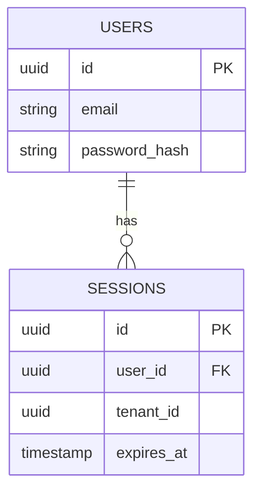

# Auth Data Model

## Tables

### users

| Column | Type | Notes |
|---|---|---|
| id | uuid | primary key |
| email | text | unique within tenant |
| password_hash | text | argon2id |

### sessions

| Column | Type | Notes |
|---|---|---|
| id | uuid | primary key |
| user_id | uuid | references users.id |
| tenant_id | uuid | references tenants.id |
| expires_at | timestamptz | session expiry |
