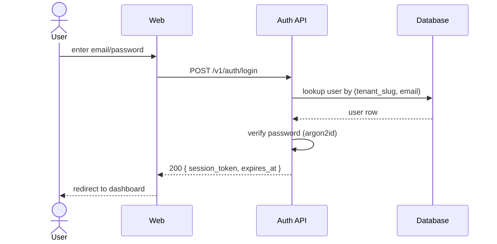

# Login Flow

```mermaid
sequenceDiagram
  actor U as User
  participant W as Web
  participant A as Auth API
  participant DB as Database

  U->>W: enter email/password
  W->>A: POST /v1/auth/login
  A->>DB: lookup user by (tenant_slug, email)
  DB-->>A: user row
  A->>A: verify password (argon2id)
  A-->>W: 200 { session_token, expires_at }
  W-->>U: redirect to dashboard
```

## Error cases

- E_AUTH_01: invalid credentials → display generic "이메일 또는 비밀번호가 일치하지 않습니다"
- TBD: rate-limit policy when 5 consecutive failures occur within 10 minutes
