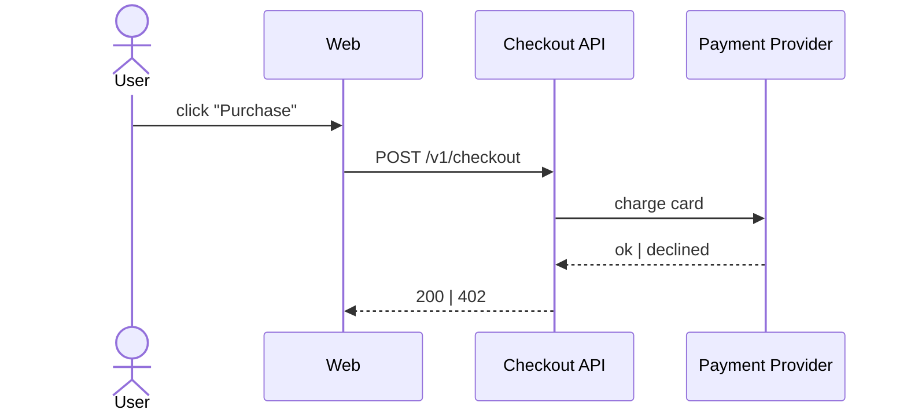

# Purchase Flow

## Localization

See [i18n notes](./i18n.md) for currency formatting and locale-aware labels.

## Error cases

- E_PAY_01: card declined → show retry option
- E_PAY_02: insufficient funds → suggest alternate payment method
